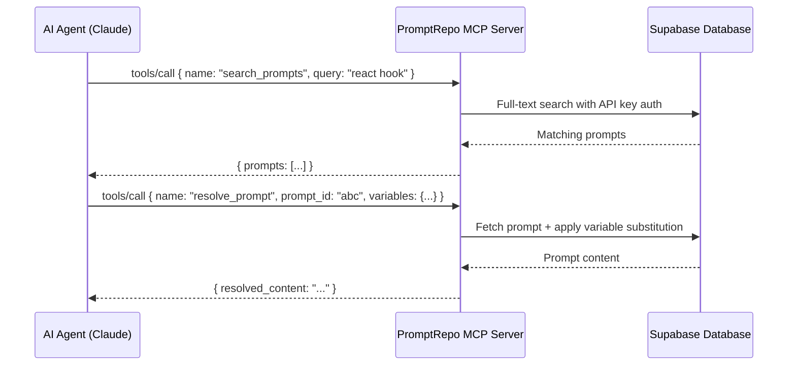

## What is MCP?

The **Model Context Protocol (MCP)** is a standardized JSON-RPC 2.0 protocol that enables AI agents to communicate with external data sources and tools. PromptRepo implements an MCP server that exposes your prompt library directly to AI assistants like Claude Code and Claude Desktop.

<Note>
Think of MCP as a **real-time API for AI agents** — instead of copy-pasting prompts manually, your AI assistant can query, search, and resolve prompts on-demand during conversations.
</Note>

## Why Use PromptRepo's MCP Server?

<CardGroup cols={2}>
  <Card title="Zero-Friction Access" icon="bolt">
    AI agents can fetch prompts without leaving their environment — no browser tab switching or copy-paste required.
  </Card>
  
  <Card title="Dynamic Resolution" icon="wand-magic-sparkles">
    Variables like `{{language}}` or `{{framework}}` are resolved at runtime, making prompts reusable across contexts.
  </Card>
  
  <Card title="Full-Text Search" icon="magnifying-glass">
    Agents can search your entire prompt library using natural language queries.
  </Card>
  
  <Card title="Version Control" icon="code-branch">
    Always get the latest version of a prompt — updates propagate instantly to all connected agents.
  </Card>
</CardGroup>

## How It Works

<Steps>
  <Step title="Agent sends JSON-RPC request">
    The AI assistant calls the MCP endpoint at `POST /api/mcp` with a tool name and parameters.
  </Step>
  
  <Step title="Authentication via API key">
    PromptRepo verifies the API key from the `Authorization` or `x-api-key` header.
  </Step>
  
  <Step title="Tool execution">
    The dispatcher routes the request to the appropriate handler (list, get, resolve, or search).
  </Step>
  
  <Step title="Response returned">
    Results are sent back to the agent as a JSON-RPC 2.0 response envelope.
  </Step>
</Steps>

## Available Tools

PromptRepo's MCP server exposes four core tools:

<AccordionGroup>
  <Accordion title="list_prompts" icon="list">
    Returns paginated prompt metadata (title, description, variables) without full content. Useful for browsing your library.
    
    **Parameters:**
    - `limit` (optional): Max results (1-100, default 20)
    - `offset` (optional): Pagination offset (default 0)
    
    **Access:**
    - Authenticated: Your prompts + public prompts
    - Anonymous: Public prompts only
  </Accordion>
  
  <Accordion title="get_prompt" icon="file-lines">
    Fetches a single prompt by ID, including full content and extracted variable names.
    
    **Parameters:**
    - `prompt_id` (required): UUID of the prompt
    
    **Access:**
    - Authenticated: Your own prompts (public/private) + others' public prompts
    - Anonymous: Public prompts only
  </Accordion>
  
  <Accordion title="resolve_prompt" icon="wand-magic-sparkles">
    Fetches a prompt and substitutes `{{variable}}` placeholders with provided values. Unmatched variables remain as-is.
    
    **Parameters:**
    - `prompt_id` (required): UUID of the prompt
    - `variables` (optional): Map of variable names to replacement values
    
    **Returns:**
    - `resolved_content`: Template after substitution
    - `unresolved_variables`: Variables without provided values
  </Accordion>
  
  <Accordion title="search_prompts" icon="magnifying-glass">
    Full-text search over accessible prompts using PostgreSQL's tsvector indexing.
    
    **Parameters:**
    - `query` (required): Search string (min 1 character)
    - `limit` (optional): Max results (1-50, default 10)
    
    **Access:**
    - Authenticated: Search your prompts + public prompts
    - Anonymous: Search public prompts only
  </Accordion>
</AccordionGroup>

## Authentication Model

PromptRepo uses **API key authentication** for MCP requests:

- **Authenticated users**: Generate an API key from `/profile`. Access your private prompts + all public prompts.
- **Anonymous users**: No API key required. Access public prompts only (read-only).

<Warning>
API keys are **bearer tokens** — treat them like passwords. Never commit them to version control or share them publicly.
</Warning>

## Next Steps

<CardGroup cols={2}>
  <Card title="Authentication Setup" icon="key" href="/mcp/authentication">
    Generate and manage API keys for secure access
  </Card>
  
  <Card title="Configuration" icon="gear" href="/mcp/configuration">
    Connect Claude Desktop, Claude Code, and other MCP clients
  </Card>
</CardGroup>

## Technical Specification

- **Protocol**: JSON-RPC 2.0 over HTTP
- **Endpoint**: `POST /api/mcp`
- **Content-Type**: `application/json`
- **CORS**: Enabled for cross-origin requests
- **Auth headers**: `Authorization: Bearer <key>` or `x-api-key: <key>`
- **Response format**: Always HTTP 200 (errors in JSON-RPC envelope)

<Note>
The MCP endpoint is excluded from session-based authentication middleware, so you **must** use API key headers — browser cookies are not supported.
</Note>